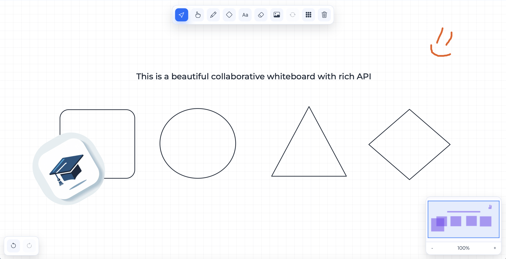
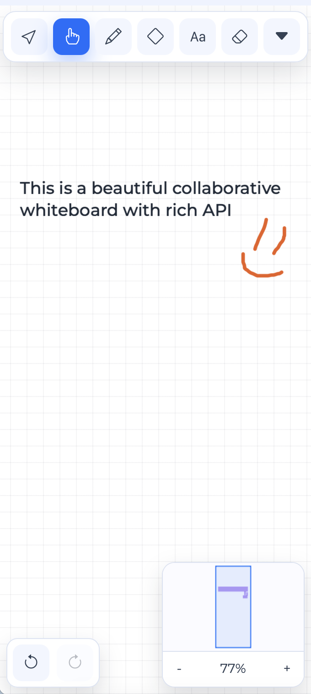

# WhiteboardCollaborative

Collaborative infinite whiteboard built with FastAPI, Fabric.js and Socket.IO. The project is designed for iframe embedding into an external platform, JWT-based access control, realtime multi-user editing, and production deployment behind Nginx.






## Features

- Infinite canvas with pan and zoom
- Realtime collaboration via Socket.IO
- JWT auth for REST, iframe access and websocket connection
- Per-user undo/redo
- Presence cursors
- Shape library, text, pencil, eraser, image upload
- Moderator controls for clearing board and drawing policy
- Production-ready Docker Compose deployment

## Stack

- Backend: FastAPI
- Realtime: python-socketio
- Frontend: Fabric.js + Bootstrap 5
- Database: SQLite
- Auth: JWT HS256

## Development

### Docker Compose

```bash
docker compose up --build
```

Сервис будет доступен на `http://localhost:8000`.

Открыть доску в dev-режиме без JWT:

- `http://localhost:8000/board/dev-board`

Если `DEBUG=True`, JWT отключается для HTTP/Socket.IO и доска может открываться напрямую в браузере.

## Production

1. Проверьте `CORS_ORIGINS` в `.env.production` и укажите домен основного сервиса.
2. Запустите:

```bash
docker compose -f docker-compose.prod.yml up -d --build
```

3. Проверка health:

```bash
curl http://localhost:8000/health
```

Остановка:

```bash
docker compose -f docker-compose.prod.yml down
```

### Local Run

```bash
python -m venv .venv
source .venv/bin/activate
pip install -r requirements.txt
cp .env.example .env
uvicorn app.main:asgi_app --reload --host 0.0.0.0 --port 8000
```

## Environment

- `JWT_SECRET` — общий секрет для JWT (HS256)
- `DATABASE_URL` — путь к SQLite базе (например `app/boards.db`)
- `CORS_ORIGINS` — список origin через запятую
- `DEBUG` — dev-режим; при `True` JWT не обязателен
- `DBUG` — алиас для `DEBUG` (поддерживается для совместимости)

Для production используется `.env.production`:

- `DEBUG=False`
- `DATABASE_URL=/data/boards.db` (persist volume `whiteboard_data`)
- `JWT_SECRET` задан
- `SERVICE_API_KEY` — ключ сервисных admin-операций

## JWT

Ожидаются claims:

- `user_id` (обязательно)
- `exp` (обязательно)
- `username` (для отображения курсоров)
- `role` (например `moderator` для права очистки доски)

JWT обязателен для:

- REST (заголовок `Authorization: Bearer <token>`)
- Socket.IO/iframe (`?token=<jwt>`)

## Service API Key

Для системных операций (без user JWT) используются endpoint’ы с заголовком:

`X-API-Key: <SERVICE_API_KEY>`

- `POST /api/admin/board/{board_id}/drawing`
  body: `{ "allow_students_draw": true|false }`
- `DELETE /api/admin/board/{board_id}`

Если `allow_students_draw=false`, рисовать через websocket смогут только пользователи с JWT role=`moderator`.

## iframe

```html
<iframe src="https://board-service/board/board123?token=JWT_TOKEN"></iframe>
```
